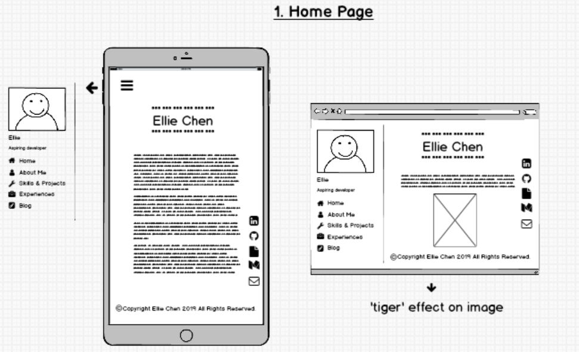
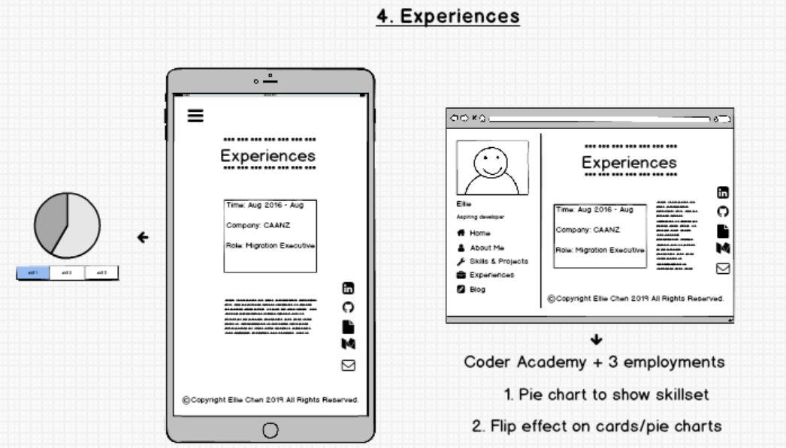

# <u>Ellie Chen's Portfolio Website</u>

## Links

Pleas feel free to check out my portfolio website: [Published portfolio website](url to be added)

Pleas feel free to check out this project on GitHub: [Portfolio website - GitHub Repo](https://github.com/EllieChen-Git/portfolio-site)

------
## <u>Overview of Portfolio Website</u>

### Purpose

The purpose of this portfolio website is to showcase my ability in coding and web development. It can also be used as an excellent medium for the target audience to know more about me personally (my hobbies and personalities) and professionally (my previous work experiences, skills and personal projects).

In addition to that, the portfolio serves as a good example to demonstrate my planning and desgining process of a website, and it is a great opportunity for me to transform what I have learned about HTML, CSS and SASS in class into a final product. If anyone is interested in knowing more, they have the access to my GitHub, LinkedIn, Medium, Resume and Emial through the website.

### Functionality/Features

Below are the features of my portfolio website:

#### Main Features
1. 'Home' page - animation/tiger effect
2. 'About Me' - hover effect on images
3. 'Skills & Projects' - carousel effect on projects
4. 'Experiences' - spinning effect on skillset pie charts
5. 'Contact Me' - a form for people to submit message

#### Other Features
1. Responsive design - browser and mobile friendly.
2. Fixed contact icons on the bottom of the page - minimise the efforts to contact me (Don't have to scroll back to home page to find my contact details)
3. Navigation bar on the top-left corner for easy access to other linked html pages

### Sitemap

The sitemap of the portfolio website can also be viewed on GitHub [Portfolio Website - Sitemap](https://github.com/EllieChen-Git/portfolio-site/blob/master/docs/sitemap.jpg)

### Screenshots

- <u>Design brief (Mood board)</u>

Refer to the mood board for this site here: [Portfolio Website - Mood Board](https://www.pinterest.com.au/elliechenetc/portfolio-site/)

- <u>Design brief (Wireframes)</u>

- <u>Project Management (Trello)</u>

Refer to the Trello board for this site here: [Portfolio Website - Project Management](https://trello.com/b/vPfF8Msm/portfolio-site)

### Target audience
- Potential employers and recruiting agencies
- Educators and cohorts
- Future collaborators on GitHub projects
- Family and friends
- people who are interested in my personal projects

### Technology Stack
- Programming languages: HTML, CSS, SASS
- Source control: git & GitHub
- Planning & implenmentation: project management (Trello), mood board (Pinterest), wireframe (Balsamiq)
- Deployment platform: GitHub

------

## <u>Future improvements</u>
- Adding an education history section
- Designing personal logo to achieve a better personal branding effect
- Incorporating JavaScript to achieve more functionalities and better effects 

Ellie Chen ©2019

