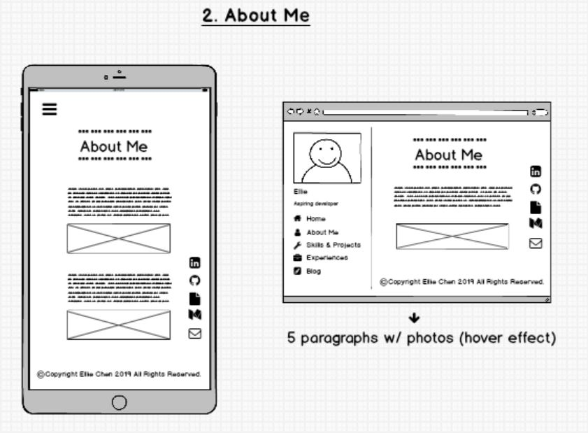
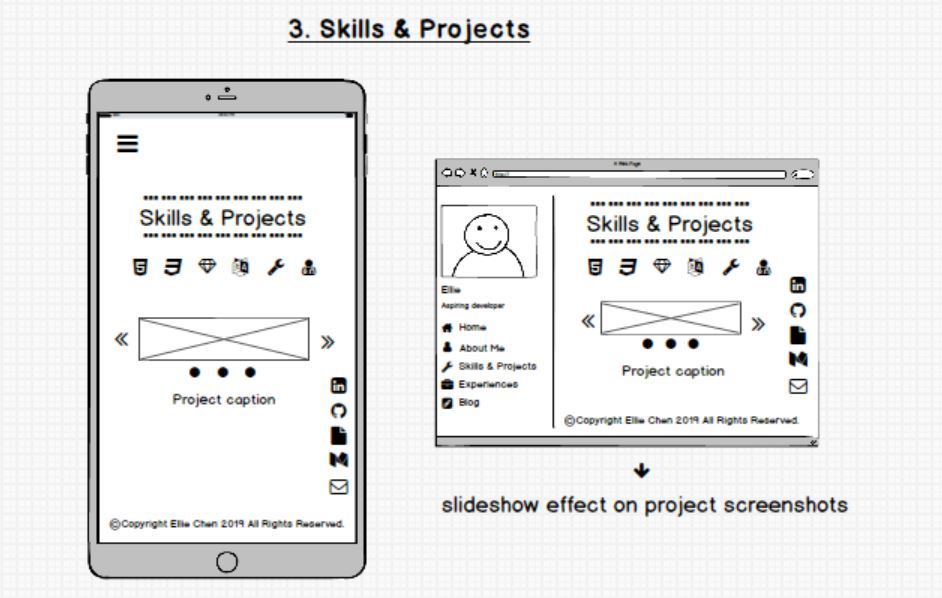
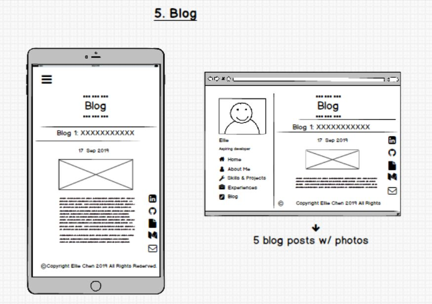

## Portfolio Website - Ellie Chen 
---
### Links

- [Deployed Portfolio Website](https://elliechen.netlify.com/)
- [GitHub Repository](https://github.com/EllieChen-Git/portfolio-site)

---
### Purpose

The purpose of this portfolio website is to showcase my ability in coding and web development. It demonstrates my capabilities to plan, design, implement and deploy a website, from a design brief to a published website. It can also be used as an excellent medium for the target audience to know more about me personally (my hobbies and personalities) and professionally (my previous work experiences, skills and projects).

In addition to that, it is a great opportunity for me to transform what I have learned about HTML, CSS and SASS in class into a final product. If anyone is interested in knowing more about me or my projects, they have the access to my GitHub, LinkedIn, Medium, Resume and Email throughout the website.

### Functionality and Features

Below are the features of my portfolio website:

#### <u>Main Features</u>

This portfolio website includes a wide variety of features to engage the audience in different ways. On almost every single page, visitors will find some fun and interesting effects along with the necessary information.

- <b>Home page - 'tiger effect' on husky image</b>

This idea came up to my mind when the teacher was giving demonstration of some CSS background image attributes. With 'background-attachment: fixed' and other CSS styling, it can achieve a super cool scrolling effect while the background image is fixed on the page. If people hover their mouse on the husky image, they will realise that each of the four sections actually functions as buttons, so users can either navigate to other pages through these buttons or through the fixed navigation bar. 

This effect is only visible on the browser version (with media break point set to 'min-width: 960px'), as I believe a simpler and cleaner layout would be more appropriate on the mobile version.

        #section-buttons{
            margin: auto;
            display: flex;
            flex-direction: column;
            align-content: center;
            justify-content: center;
            width: 100%;

            .button-scrolly {
                display: block;
                position: relative;
                left: 270px;
                padding: 40px 0;
                width: 100%;
                cursor: pointer;
                background-image: url(/images/hunter.jpg);
                background-repeat: no-repeat;
                background-position: center;
                background-attachment: fixed;
                background-size: contain;
                margin: 5px;
                opacity: 0.8;
            }
        }

- <b>About Me page - hover effect on images</b>

This page is about my professional background and my hobbies. Instead of writing big chunks of texts, I decided to make the photos speak the stories. If people hover on the images, there will be a zoom in effect, which was achieved by the transition and transform properties.

        .image.featured {
            display: block;
            margin-left: auto;
            margin-right: auto;
            width: 50%;
            height:70%; 
            overflow: hidden;
            border-radius: 5%;

            img {
                cursor: auto; 
                transition: all 1.5s ease-out;
                width: 100%;
                &:hover{
                    transform: scale(1.2);
                }
            }
        }

- <b>Skills & Projects page - skills icons & slideshow effect on projects</b>

On this page, I utilised different skills icons to showcase my skills. I also added a short description when people hover their mouse on the icons, in case that some of them might not be familiar with the implication of each skills icon.

I also implemented a slideshow effect on the major projects I have done so far, which was achieved by CSS styles and JavaScript.

- <b>Experiences page - flipping effect on skillset pie charts</b>

On this page, I first created pie charts to demonstrate my skillset for each of my work experiences. Then, I used the CSS styling to achieve a flip card effect. When people hover their mouse on the card, it will turn to my skillset pie chart.

#### <u>Other Features</u>
- <b>Responsive design</b>

This website is browser and mobile friendly and is an example of mobile first design. A media break point was set to 'min-width: 960px' to achieve certain effects on browsers. For instance, the whole website has a two-rows layout on browsers, but a columns layout applied on mobiles. Another example is the experiences page. On the browser version, the flip cards and job duties sit side by side, but they will turn into columns on the mobile version. Flex box was utilised to achieve the above layout effects.

- <b>Fixed navigation bar</b>

In order for the users to easily access every page of the website, a navigation bar permanently stays on the left of the screen in the browser version.

The navigation bar is transformed to the hamburger menu (with a burger icon) on the mobile version as smaller devices will not have the space for a fixed navigation bar.

- <b>Fixed contact/social icons bar</b>
Another feature of the website is the fixed contact/social icons bar, which will always stay on the right of the website. This was intentionally designed to minimise the efforts for people to contact me (i.e. people don't have to scroll back to home page to find my contact details).

- <b>Accessibility</b>
This website passed the accessibility test (100%) on Chrome Dev Tools. All the images came with an alternative text to facilitate visually impaired people to visit my website.

- <b>Subresource integrity </b>
This website is also secured by the subresource integrity hash keys to prevent malicious manipulation of the styles of the website.

### Sitemap

The sitemap of the portfolio website can also be viewed on GitHub: [Portfolio Website - Sitemap](https://github.com/EllieChen-Git/portfolio-site/blob/master/docs/sitemap.JPG)

### Design Brief

- <u>Mood board</u>

Mood board for this site can also be found on Pinterest: [Portfolio Website - Mood Board](https://www.pinterest.com.au/elliechenetc/portfolio-site/)

- <u>Wireframes</u>

The wireframes of the portfolio website can also be viewed on GitHub: [Portfolio Website - Wireframes](https://github.com/EllieChen-Git/portfolio-site/tree/master/docs/wireframes)

- <u>Project Management</u>

Trello board for this site can be found here: [Portfolio Website - Project Management](https://trello.com/b/vPfF8Msm/portfolio-site)

- Trello screenshot - 17 Sep

- Trello screenshot - 18 Sep

- Trello screenshot - 19 Sep

- Trello screenshot - 20 Sep

- Trello screenshot - 21 Sep

---
### Screenshots

---

### Target Audience
- Potential employers and recruiting agencies
- Educators and cohorts
- Family and friends
- People who are interested in my personal projects

### Technology Stack
- Programming languages: HTML, CSS, SASS
- Source control: git & GitHub
- Planning & implementation: 1. project management (Trello), 2. mood board (Pinterest), 3. wireframe (Balsamiq)
- Deployment platform: Netlify
- Subresource Integrity hash: sha-512 

------

### Future Improvements
- Adding an education history section
- Designing personal logo to achieve a better personal branding effect

© Copyright Ellie Chen 2019. All Rights Reserved.

